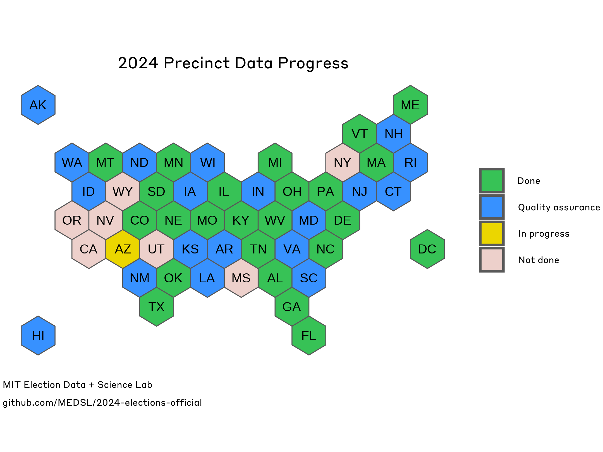

# 2024-elections-official

## Repository info
This is the MEDSL repository for election returns from the 2024 General Election in the United States. We have begun compiling precinct-level election results. If you notice any issues in our results, please open an Issue in this repository. 

## General usage notes
### Methods and accuracy
For any questions about how we clean and Quality Assure these data, and how accurate they are, please consult this paper, which answers those questions for our 2016, 2018, and 2020 precinct data efforts: https://www.nature.com/articles/s41597-022-01745-0.

### Warnings
* In general, users need to exercise real caution when computing descriptive statistics. Please make sure you understand exactly which rows belong in the computation you're performing. Here are two of the most common issues:
   * Sometimes the way that states report data generates fictitious zero-vote rows, where a candidate is recorded as getting no votes in a precinct where they did not actually appear on the ballot. It is not generally possible to ensure that all real zero-vote totals are recorded while no fictitious zero-vote totals are recorded. This could affect, for example, measures of central tendency.
   * We typically retain exactly the modes that states report. This can lead to double-counting if users do not select the correct modes, for example if modes are split apart *and* a mode value of `TOTAL` is included. Users should make sure that any analysis includes votes of each mode once.
* While we attempt to verify every value of every variable, `magnitude` values in particular may be approximate for local-level offices. Please double-check these values before relying on them. We are also still working to make sure that the `NONPARTISAN` value of the party fields is propagated correctly to local offices.
* `mode` values typically retain the state's original classification. These original data sources may not identify modes in a way that is consistent across jurisdictions, and one jurisdiction may report more granularly or more accurately than another. For example, `UOCAVA` ballots may be classed as `ABSENTEE` without any means to disaggregate them.

## State-specific information
### Alabama
*Added:* 2025-10-31  
*[Source](https://www.sos.alabama.gov/alabama-votes/voter/election-data)*  

*Note:* Alabama gives voters an option to check one box to cast a straight ticket ballot (e.g. vote for all Republican candidates). We denote this is `office = "STRAIGHT PARTY"`.

### Alaska
*Added:* 2025-11-19  
*[Source](https://www.elections.alaska.gov/election-results/e/?id=24genr)*  

### Arizona
*Added:*  
*[Source]()*  

### Arkansas
*Added:* 2025-11-07  
*[Source](https://results.enr.clarityelections.com/AR/122502/web.345435/#/reporting)*  

### California
*Added:*  
*[Source]()*  

### Colorado
*Added:* 2025-10-24  
*[Source](https://www.sos.state.co.us/pubs/elections/resultsData.html)*  

### Connecticut
*Added:* 2025-11-05  
*[Source](https://ctemspublic.tgstg.net/#/home)*  

### Delaware
*Added:* 2024-11-13  
*[Source](https://elections.delaware.gov/results/html/index.shtml?electionId=GE2024)*  

### District of Columbia
*Added:* 2025-01-23  
*[Source](https://electionresults.dcboe.org/election_results/2024-General-Election)*  

### Florida
*Added:* 2025-04-27  
*[Source](https://dos.fl.gov/elections/data-statistics/elections-data/precinct-level-election-results/)*  

### Georgia
*Added:* 2025-10-30 
*[Source (precinct data)](https://results.sos.ga.gov/results/public/Georgia/elections/2024NovGen)* 
*[Source (office crosswalk)](https://results.sos.ga.gov/results/public/Georgia/elections/2024NovGen/reports)* 

### Hawaii
*Added:* 2025-11-19  
*[Source (precinct data)](https://elections.hawaii.gov/election-results/)*  
*[Source (precinct-to-county crosswalk)](https://elections.hawaii.gov/resources/districts-and-precincts/)*  

### Idaho
*Added: 2025-12-17*  
*[Source](https://voteidaho.gov/election-results/)*  

### Illinois
*Added:* 2025-02-13  
*[Source](https://www.elections.il.gov/electionoperations/ElectionVoteTotalsPrecinct.aspx?ID=rfZ%2buidMSDY%3d)*  

### Indiana
*Added:* 2025-08-03  
*[Source (official state data)](https://enr.indianavoters.in.gov/site/index.html)*  
*[Source (supplemental OpenElections data)](https://github.com/openelections/openelections-data-in/tree/master/2024/counties)*  

**Warning:** Major caveats apply to Indiana’s data completeness and accuracy. See repository notes for missing counties and aggregation limitations.

### Iowa
*Added:* 2025-11-03 
*[Source](https://sos.iowa.gov/elections/results/precinctvotetotals2024general.html)*  

### Kansas
*Added:* 2025-07-23  
*[Source](https://sos.ks.gov/elections/election-results.html)*  

**Notes:** A `*` indicates masked vote totals to preserve voter privacy.

### Kentucky
*Added:*  
*[Source]()*  

### Louisiana
*Added:*  2026-01-20
*[Source](https://voterportal.sos.la.gov/static/2024-11-05)*  

**Notes:** Louisiana reports early voting only at the parish level, as such early votes are NOT included in the precinct data.

### Maine
*Added:* 2025-10-27  
*[Source](https://www.maine.gov/sos/cec/elec/results/results24.html)*  

**Notes:** For some observations `jurisdiction_fips` was unable to be determined.

### Maryland
*Added:* 2025-11-13  
*[Source](https://www.elections.maryland.gov/elections/2024/index.html)*  

### Massachusetts
*Added:* 2025-10-24  
*[Source](https://electionstats.state.ma.us/elections/search/year_from:2024/year_to:2024/stage:General)*  

### Michigan
*Added:* 2025-10-24  
*[Source](https://mielections.us/election/results/)*  

### Minnesota
*Added:* 2025-02-13  
*[Source](https://electionresults.sos.mn.gov/Select/MediaFiles/Index?ersElectionId=170)*  

### Mississippi
*Added:*  
*[Source]()*  

### Missouri
*Added:* 2025-10-24  
*[Source](https://enr.sos.mo.gov/)*  

### Montana
*Added:* 2024-12-16  
*[Source](https://electionresults.mt.gov/ResultsSW.aspx)*  

### Nebraska
*Added:* 2025-10-24  
*[Source](https://electionresults.nebraska.gov/default.aspx)*  

### Nevada
*Added:* 2025-11-10 
*[Source (results)](https://www.nvsos.gov/electionresults/)*  
*[Source (parties)](https://www.nvsos.gov/sos/elections/election-information/2024-election-information)*  

### New Hampshire
*Added:* 2025-07-13  
*[Source](https://www.sos.nh.gov/2024-general-election-results)*  

### New Jersey
*Added:* 2026-02-04
*Source:* NJ's data is collected from a number of locations, including:
- https://www.nj.gov/state/elections/election-night-results.shtml
- https://github.com/openelections/openelections-data-nj/tree/master/2024
- https://www.co.hunterdon.nj.us/DocumentCenter/View/15968/G2024-Official-Elections-Results-PDF 
- https://sussexcountyclerk.org/wp-content/uploads/2025/01/OFFICIAL-Precinct-Rpt-suppressed-11-25-Amended-web.pdf
- https://www.warrencountyvotes.com/home/showpublisheddocument/11384
- https://www.camdencounty.com/wp-content/elections/general2024/2024_General_Election_Canvasser.pdf
- https://www.bergencountyclerk.gov/_Content/pdf/ElectionResult/2024%20General%20District%20Report(2).pdf
- https://www.livevoterturnout.com/ENR/salemnjenr/7/en/Index_7.html
- https://gloucestercountynj.gov/1252/Previous-Election-Results

**Notes:** In 2024 NJ reported its data at the election district level but also included totals at the municipal level. For instance, an observation with `precinct = "Cliffside Park"` provides the total votes across "Cliffside Park 01", "Cliffside Park 02", etc. Care should be taken to not double count votes by including both the municipal totals and election district vote counts.

### New Mexico
*Added:* 2025-07-23  
*[Source](https://electionresults.sos.nm.gov/)*  

**Notes:** A `*` indicates masked vote totals for privacy.

### New York
*Added:*  
*[Source]()*  

### North Carolina
*Added:* 2024-12-16  
*[Source](https://www.ncsbe.gov/results-data/election-results/historical-election-results-data)*  

### North Dakota
*Added:* 2025-11-10  
*[Source](https://results.sos.nd.gov/ResultsExport.aspx?)*  

### Ohio
*Added:* 2025-10-31  
*[Source](https://www.ohiosos.gov/elections/election-results-and-data/2024-official-election-results/)*  

### Oklahoma
*Added:* 2024-11-14  
*[Source](https://results.okelections.gov/OKER/?elecDate=20241105)*  

### Oregon
*Added:*  
*[Source]()*  

### Pennsylvania
*Added:* 2025-10-24  
*[Source](https://www.pa.gov/agencies/dos/resources/voting-and-elections-resources/voting-and-election-statistics/bulk-election-data.html#accordion-b33bb36a11-item-d105bc02cf)*  

### Rhode Island
*Added:*  
*[Source]()*  

### South Carolina
*Added:* 2025-05-05  
*[Source](https://www.enr-scvotes.org/SC/122436/web.345435/#/access-to-races)*  

### South Dakota
*Added:* 2024-11-21  
*[Source (official results)](https://electionresults.sd.gov/Default.aspx)*  
*[Source (candidate party labels)](https://vip.sdsos.gov/candidatelist.aspx?eid=684)*  

### Tennessee
*Added:* 2024-12-05  
*[Source](https://sos.tn.gov/elections/results)*  

### Texas
*Added:*  
*[Source]()*  

### Utah
*Added:* 2025-11-07  
*[Source](https://electionresults.utah.gov/results/public/utah/elections/general11052024)*  

### Vermont
*Added:* 2025-10-24  
*[Source](https://electionarchive.vermont.gov/elections/search/date:2024-11-05)*  

### Virginia
*Added:* 2025-07-26  
*[Source](https://enr.elections.virginia.gov/results/public/Virginia/elections/2024NovemberGeneral)*  

### Washington
*Added:* 2025-11-07 
*[Source](https://results.vote.wa.gov/results/20241105/export.html)*  

### West Virginia
*Added:* 2025-10-24  
*[Source](https://results.enr.clarityelections.com/WV/122766/web.345435/#/summary)*  

### Wisconsin
*Added:* 2025-11-07  
*[Source](https://elections.wi.gov/elections/election-results#accordion-11951)*  

### Wyoming
*Added: 2025-12-17*  
*[Source](https://sos.wyo.gov/Elections/Docs/2024/2024GeneralResults.aspx)*  

---

All sections without current entries are placeholders and will be updated as additional states are processed.
